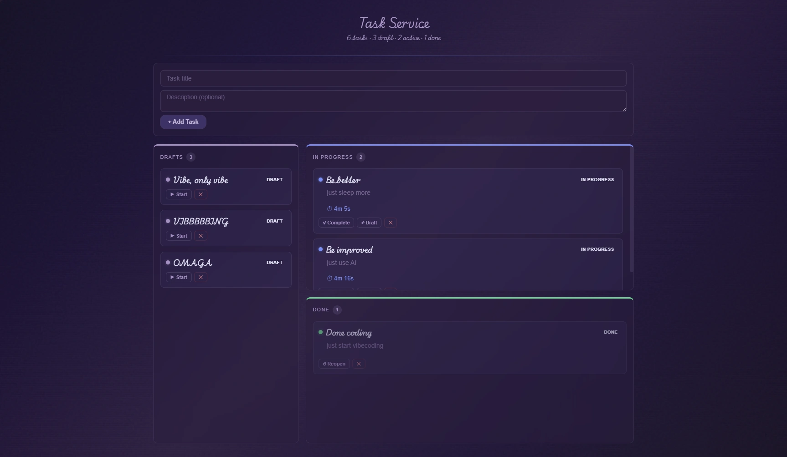

# Task Service

A lightweight task tracking service with an HTMX-powered web interface and a JSON REST API.

<div align="center">
  
</div>

---

## Table of Contents

- [Features](#features)
- [Quick Start](#quick-start)
- [Consumer Guide](#consumer-guide)
  - [Configuration](#configuration)
  - [Running the Service](#running-the-service)
  - [Web Interface](#web-interface)
  - [REST API](#rest-api)
- [Developer Guide](#developer-guide)
  - [Architecture](#architecture)
  - [Project Structure](#project-structure)
  - [Task Model](#task-model)
  - [Extending the Service](#extending-the-service)
  - [Building and Testing](#building-and-testing)
  - [Dependencies](#dependencies)

---

## Features

- **Server-rendered web UI** built with [HTMX](https://htmx.org). No client-side JavaScript framework required.
- **Full REST API** with JSON request/response payloads for programmatic access.
- **Actor-based concurrency model** — all data operations are serialized through a single goroutine, eliminating the need for locks or mutexes.
- **File-per-task persistence** — each task is stored as an independent JSON file, enabling straightforward backup and recovery.
- **Built-in time tracking** — elapsed time is automatically accumulated while a task is in the *In Progress* state.
- **Defined status workflow** — `Draft → In Progress → Done`, with full transition support.

---

## Quick Start

### Prerequisites

| Requirement | Version |
|-------------|---------|
| Go          | >= 1.22 |

### Installation

```bash
git clone <repository-url> task-service
cd task-service
go run ./cmd
```

The service listens on **http://localhost:8080** by default.

---

## Consumer Guide

This section covers everything you need to run and interact with the service.

### Configuration

The service reads `config.json` from the current working directory on startup.

```json
{
  "port": ":8080",
  "version": "1.0.0"
}
```

| Field     | Description                | Default  |
|-----------|----------------------------|----------|
| `port`    | TCP address to bind        | `:8080`  |
| `version` | Application version label  | `0.0.1`  |

If the configuration file does not exist at startup, one is generated automatically with default values.

### Running the Service

**From source:**

```bash
go run ./cmd
```

**Compiled binary:**

```bash
go build -o task-service ./cmd
./task-service          # Linux / macOS
task-service.exe        # Windows
```

### Web Interface

1. Navigate to **http://localhost:8080**.
2. Provide a **Title** (required) and an optional **Description**.
3. Select **Create** to add a task.
4. Each task card provides controls to advance its status through the workflow:
   `Draft → In Progress → Done`.
5. Select the delete control to remove a task.

### REST API

All API routes are served under the `/api/tasks` prefix.

#### Endpoints

| Method   | Path              | Description        |
|----------|-------------------|--------------------|
| `GET`    | `/api/tasks`      | List all tasks     |
| `POST`   | `/api/tasks`      | Create a task      |
| `GET`    | `/api/tasks/{id}` | Get a task by ID   |
| `PUT`    | `/api/tasks/{id}` | Update a task      |
| `DELETE` | `/api/tasks/{id}` | Delete a task      |

#### Examples

**List all tasks:**

```bash
curl http://localhost:8080/api/tasks
```

**Create a task:**

```bash
curl -X POST http://localhost:8080/api/tasks \
  -H "Content-Type: application/json" \
  -d '{"title":"My task","description":"Optional details"}'
```

**Retrieve a single task:**

```bash
curl http://localhost:8080/api/tasks/{id}
```

**Update a task:**

```bash
curl -X PUT http://localhost:8080/api/tasks/{id} \
  -H "Content-Type: application/json" \
  -d '{"title":"Updated","description":"New description","status":"In Progress"}'
```

Accepted status values: `Draft`, `In Progress`, `Done`.

**Delete a task:**

```bash
curl -X DELETE http://localhost:8080/api/tasks/{id}
```

#### Response Format

All endpoints return JSON. A typical task object:

```json
{
  "id": "2ee1efe6-b8cb-4cf6-9ddd-5ce6236e8920",
  "title": "Write documentation",
  "description": "Complete the README",
  "status": 0,
  "started_at": "2025-01-15T10:30:00Z",
  "time_spent": 3600
}
```

---

## Developer Guide

This section is intended for contributors and anyone maintaining or extending the codebase.

### Architecture

```
                     HTTP Layer
                    (chi router)
                   ┌────────────┐
                   │            │
 Browser ─────────▶│  Handlers  │──────────▶ Storage Actor
  (HTMX/API)       │            │             (goroutine)
                   └────────────┘                  │
                        ▲                         ▼
                        │                  ┌──────────────┐
                        └────────────────  │ File System  │
                             Results       │ (data/*.md)  │
                                           └──────────────┘
```

**Design decisions:**

1. **Actor concurrency model.** The `storage.Actor` is the sole owner of all task data. Inbound operations are submitted as typed `Command` values over a Go channel; results are returned on a per-request reply channel. This design eliminates shared-memory access without requiring locks or mutexes.

2. **Sealed command interface.** `storage.Command` uses an unexported marker method (`isCommand()`), restricting implementations to the types defined within the `storage` package. This ensures the actor's command set is closed for modification.

3. **File-per-task storage.** Each task is persisted as an independent JSON file under `data/`. A companion `lock.json` file maintains a secondary index of all task IDs. This approach simplifies backup, inspection, and recovery at the cost of linear-scan reads.

4. **Server-side rendering.** HTML is generated by Go templates (`internal/http/templates.go`) and served as partial fragments over HTMX. The browser does not execute application JavaScript.

### Project Structure

```
task-service/
├── cmd/
│   └── main.go                    # Entry point — loads config, wires dependencies, starts server
├── internal/
│   ├── config/
│   │   └── config.go              # JSON configuration loader (atomic.Value-backed)
│   ├── http/
│   │   ├── handler.go             # HTTP handlers for pages, HTMX partials, and JSON API
│   │   ├── router.go              # Chi router construction and route registration
│   │   ├── templates.go           # Go html/template rendering functions
│   │   └── chi_helper.go          # URL parameter extraction utilities
│   └── storage/
│       ├── actor.go               # Actor goroutine — command dispatch loop and handlers
│       ├── command.go             # Sealed Command interface and concrete command types
│       ├── result.go              # Result struct returned from actor operations
│       ├── status.go              # Task status enumeration and parser
│       ├── task.go                # Task model with status transition and time tracking
│       └── store.go               # File I/O — load, persist, and delete task files
├── data/                          # Runtime data directory (git-ignored)
│   ├── {uuid}.md                  # Individual task JSON files
│   └── lock.json                  # Task ID index
├── config.json                    # Application configuration file
├── .gitignore
├── go.mod
└── go.sum
```

### Task Model

```go
type Task struct {
    ID          string     `json:"id"`
    Title       string     `json:"title"`
    Description string     `json:"description"`
    Status      Status     `json:"status"`              // Draft | InProgress | Done
    StartedAt   *time.Time `json:"started_at,omitempty"`
    TimeSpent   int64      `json:"time_spent,omitempty"` // cumulative seconds in InProgress
}
```

**Status transitions:**

```
                    Start                        Complete
  ┌─────────┐ ──────────────── ▶ ┌───────────────┐ ──────────────▶ ┌──────┐
  │  Draft  │                    │  In Progress  │                 │ Done │
  └─────────┘ ◀ ──────────────── └───────────────┘ ◀ ───────────── └──────┘
                    Reopen                           Reopen
```

- Entering `In Progress` sets `StartedAt` to the current time.
- Leaving `In Progress` accumulates the elapsed interval into `TimeSpent`.

### Extending the Service

| Goal | Procedure |
|------|-----------|
| Add a storage operation | Define a new command type in `internal/storage/command.go`, implement a handler method on `Actor` in `actor.go`, and add the corresponding case to the `run()` dispatch loop. |
| Add an API endpoint | Add a handler method in `internal/http/handler.go` and register the route in `router.go`. |
| Add a UI component | Add or update template rendering functions in `internal/http/templates.go`. |

### Building and Testing

```bash
# Run tests
go test ./...

# Build release binary
go build -o task-service ./cmd
```

### Dependencies

| Package | Purpose |
|---------|---------|
| [`github.com/go-chi/chi/v5`](https://github.com/go-chi/chi) | HTTP router |

No database drivers, ORM layers, or external services are required.

---

## License

This project is licensed under the [MIT License](LICENSE).
